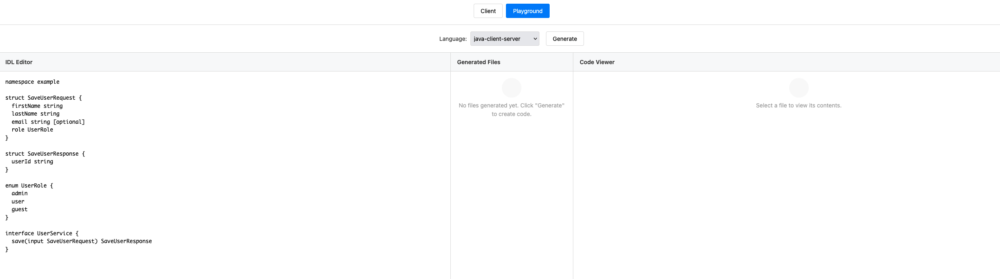

# PulseRPC

PulseRPC is a remote procedure call system similar to gRPC that uses JSON-RPC encoded messages but
adds an interface definition system so that the message payloads can be easily documented (for humans)
and validated (by computers).

To use PulseRPC you author an IDL file that describes the services you wish to expose along with the
input and output types related to the service calls.

Here's a simple example:

```
// This is a comment
interface UserService {
    save(input SaveUserRequest) SaveUserResponse
}

struct SaveUserRequest {
    firstName string
    lastName  string
    email     string   [optional]   // optional fields are nullable, other fields are non-null by default
    role      UserRole
}

struct SaveUserResponse {
    userId string   // generated user ID
}

enum UserRole {
    admin
    employee
    customer
}
```

## Web UI and Playground

PulseRPC includes a web UI with an interactive playground that allows you to experiment with IDL definitions and generate code for multiple languages directly in your browser.



### Starting the Web UI

To start the web UI server:

```bash
./target/pulserpc -ui -ui-port 8080
```

Then open your browser to `http://localhost:8080`

### Playground Features

The playground provides:

- **Live IDL Editor**: Write and edit IDL definitions with syntax highlighting
- **Multi-Language Code Generation**: Generate code for Go, Java, Python, TypeScript, and C#
- **Interactive File Browser**: Browse generated files with syntax highlighting
- **ZIP Download**: Download all generated files as a ZIP archive
- **Session Persistence**: Your IDL and runtime selection persist in browser localStorage
- **Automatic Cleanup**: Generated sessions expire after 2 hours

### Supported Languages

The playground supports generating client and server code for:

- **Go** (`go-client-server`): Modern Go code with interfaces and structs
- **Java** (`java-client-server`): Java code with Jackson or Gson JSON library support
- **Python** (`python-client-server`): Python 3 code with type hints
- **TypeScript** (`ts-client-server`): TypeScript code for Node.js and browsers
- **C#** (`csharp-client-server`): C# code for .NET applications

### API Endpoints

The playground also exposes REST API endpoints for programmatic access:

- `POST /api/playground/generate`: Generate code from IDL
  ```json
  {
    "idl": "namespace test\n\nstruct User { name string }",
    "runtime": "go-client-server"
  }
  ```

- `GET /api/playground/files/:session-id/:file-path`: Retrieve a generated file
- `GET /api/playground/zip/:session-id`: Download all files as ZIP archive

## Documentation

Comprehensive documentation is available at **[https://bitmechanic.github.io/pulserpc/](https://bitmechanic.github.io/pulserpc/)** (or build locally with `make docs-build`).

The documentation includes:

- **Installation Guide**: Multiple installation methods (Go install, binary, Docker, source)
- **IDL Guide**: Complete reference for the Interface Definition Language
- **Language Quickstarts**: Step-by-step tutorials for Go, Java, Python, TypeScript, and C#
- **Language Reference**: Type mappings, patterns, and best practices for each language
- **Examples**: Working e-commerce checkout API in all supported languages

### Building Documentation Locally

```bash
# Build the documentation site
make docs-build

# Serve locally at http://localhost:4000
make docs-serve
```

See [docs/DEPLOYMENT.md](docs/DEPLOYMENT.md) for deployment instructions.
